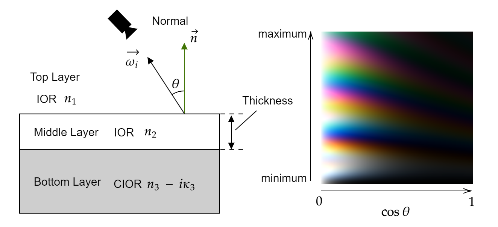
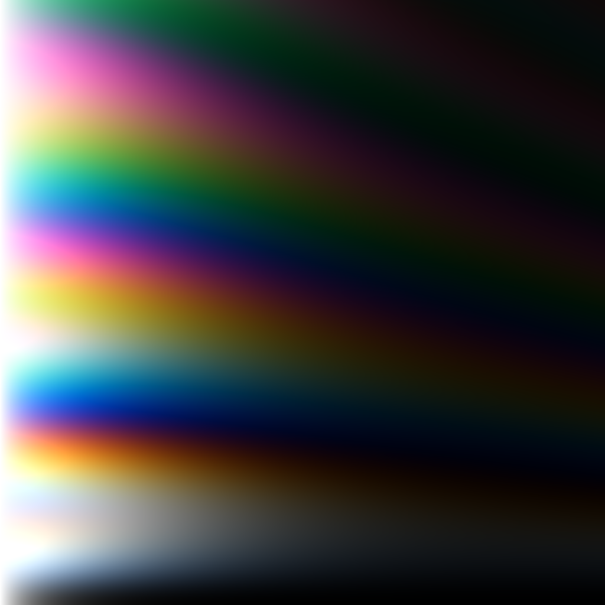

# TFI_LUTCreator
A Practical Extension to Microfacet Theory for the Modeling of Varying Iridescence[Belcour, Barla 2017]に基づいたThin-Film Interference(干渉薄膜)のFresnel値のLUTを生成するUnity Editor拡張です。

LUTは薄膜の厚み(Thickness)と入射角のコサイン(cosθ)をそれぞれ縦横としたPNG画像として出力されます。

## 導入方法
1. ReleaseよりUnityPackageをダウンロード
2. UnityPackageをプロジェクトにimport
3. Window->LUTCaptureから起動

## 実行方法
1. Initializeを実行
2. Preview画面を見ながら、LUTに記録する項目を設定
3. Capture LUTを実行、ファイルの保存先を設定する

## 各項目について
- Initialize : 初期設定

- Capture LUT : LUTの生成

- Preview Setting
    - Layer Thickness : Preview画面のスフィアのThickness

- Texture Setting
    - TextureSize : LUTの出力テクスチャサイズ
    - MinimamThickness : LUTで記録するThicknessの最小値 
    - MaximamThickness : LUTで規則するThicknessの最大値

- Thin-Film Interference Setting
    - Default Parameter : 初期パラメーターに設定
    - Top Layer IOR : Top Layerの屈折率
    - Middle Layer IOR : Middle Layerの屈折率
    - Bottom Layer CIOR : Bottom Layerの複素屈折率(CIOR)
        - Directric IOR : Bottom Layerを誘電体(非金属)とする場合
            - Dielectric IOR : IORの設定

        - Color Control Metallic CIOR : Bottom Layerを金属とする場合
            - BaseColor : 金属のベースカラー
            - EdgeTint : 金属のエッジ付近の追加色

        - Direct control CIOR : 直接、複素屈折率の設定を行う
            - Bottom Layer IOR : 複素屈折率の実部(RGB)
            - Bottom Layer Exitincion Coffiecient : 複素屈折率の虚部(RGB)
            
## Example LUT 

## Reference
- A Practical Extension to Microfacet Theory for the Modeling of Varying Iridescence
- Artist Friendly Metallic Fresnel
- MaterialX mx_microfacet_specular.glsl

## 免責事項
このプログラムを実行したことによって生じたいかなる損害等の一切の責任を負いません。